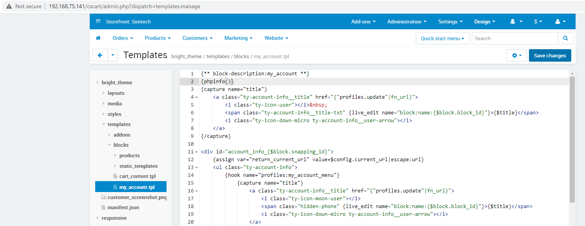
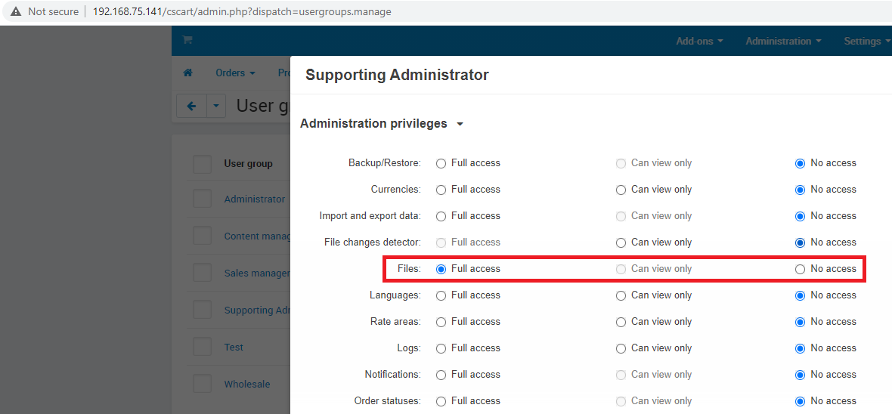

# CS-Cart templates.manage Server Side Template Injection Remote Code Execution Vulnerability

Found by: Steven Seeley of 360 Vulcan Team  
Version: <= 4.12.x (latest)  
Date: 2021-01-08 12:49  
CVE: CVE-2021-26121  

# Disclosure Timeline

- 2021-01-26 – Sent to CSCart dev team
- 2021-01-27 – Notification of reciept from CSCart dev team
- 2021-02-10 – Response from CSCart as not a security bug
- 2021-02-12 – Public disclosure

# Summary

A shop admin (not to be confused with a root admin) can gain remote code execution via server-side Smarty template injection when editing templates. This is due to the fact that CSCart doesn't implement the Smarty sandbox as described in the documentation https://www.smarty.net/docs/en/advanced.features.tpl#advanced.features.security. 

# Notes

This is not normally a huge concern but on CSCart it means that a shop admin can get access to other shop admins data (and the underlying OS). I imagine you do consider this security boundary, which is why you patched CVE-2017-15673.

# Proof of Concept

When logged in as a Shop admin you can edit any of the templates. In this case I edited the `my_account.tpl` template file adding `{phpinfo()}`

Then, after viewing the index page and clicking the my account drop down menu, it's possible to trigger the template execution:

It's also possible to trigger this vulnerability if the shop admin has just `Files` access via group assignment with no other permission.

And here is the vulnerability impacting the `https://[redacted]/` demo site:

